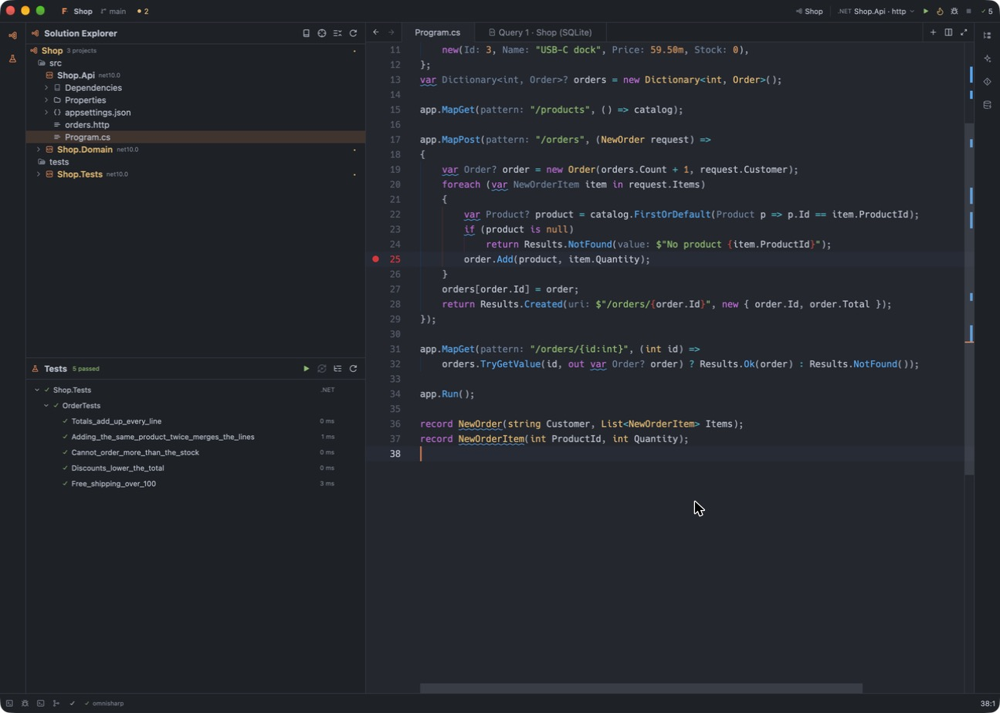
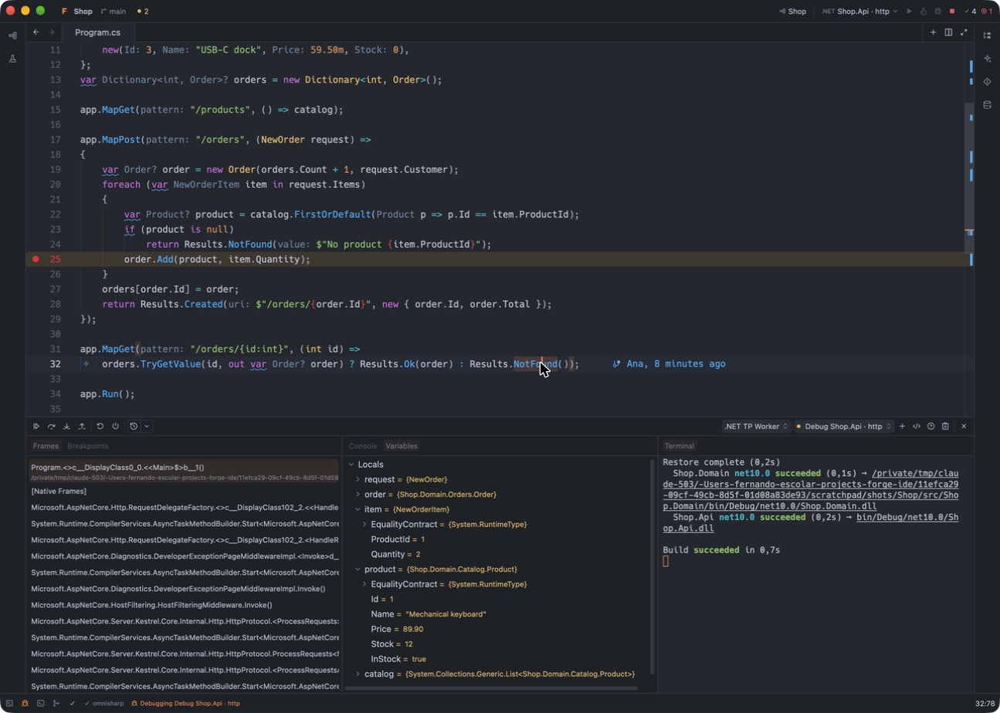
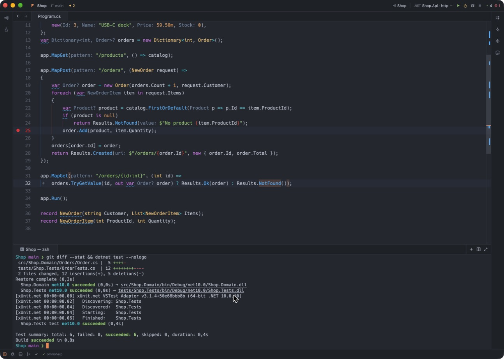
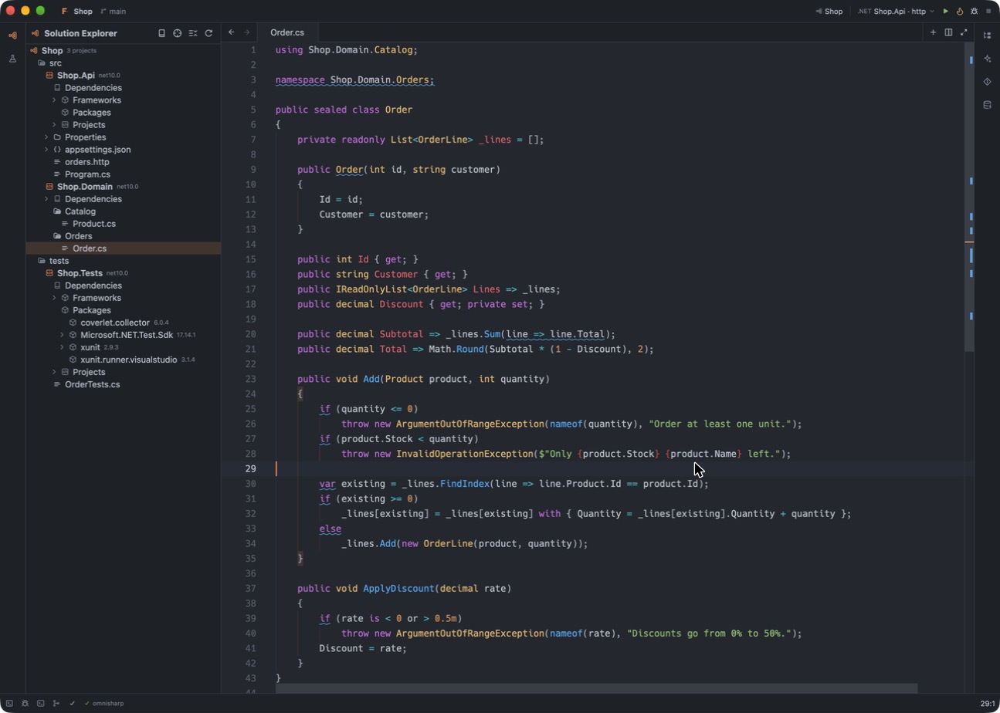
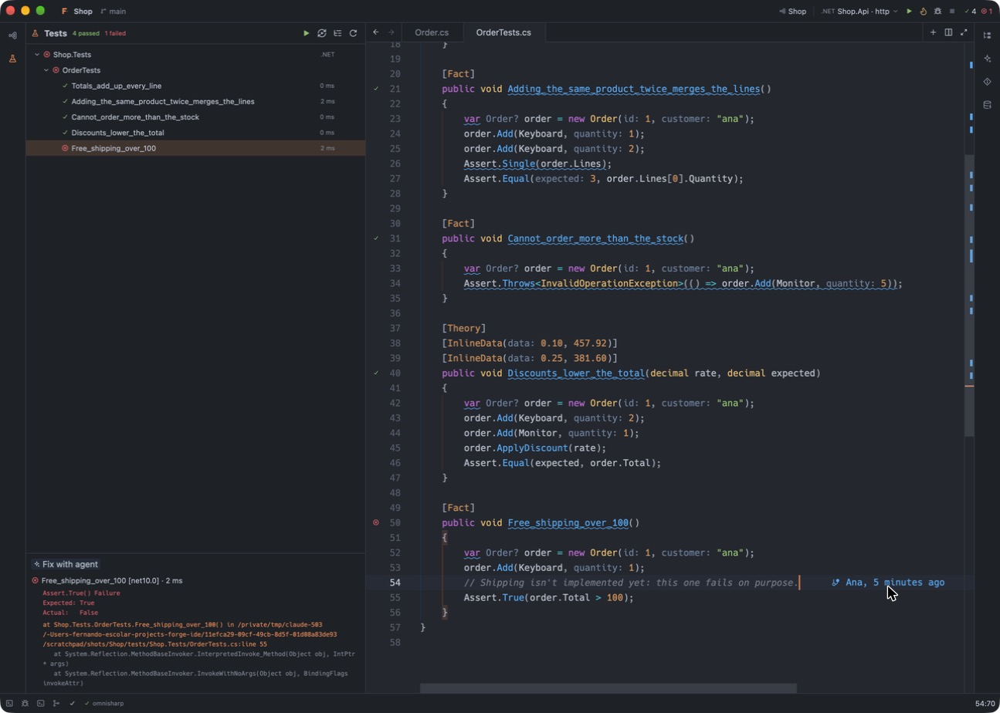
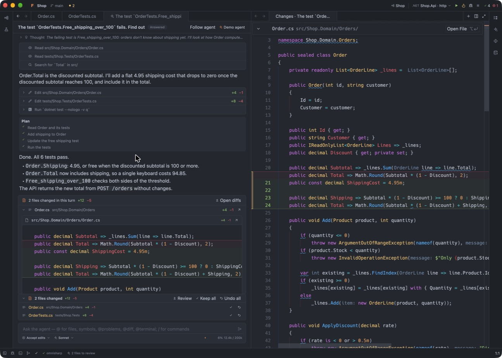
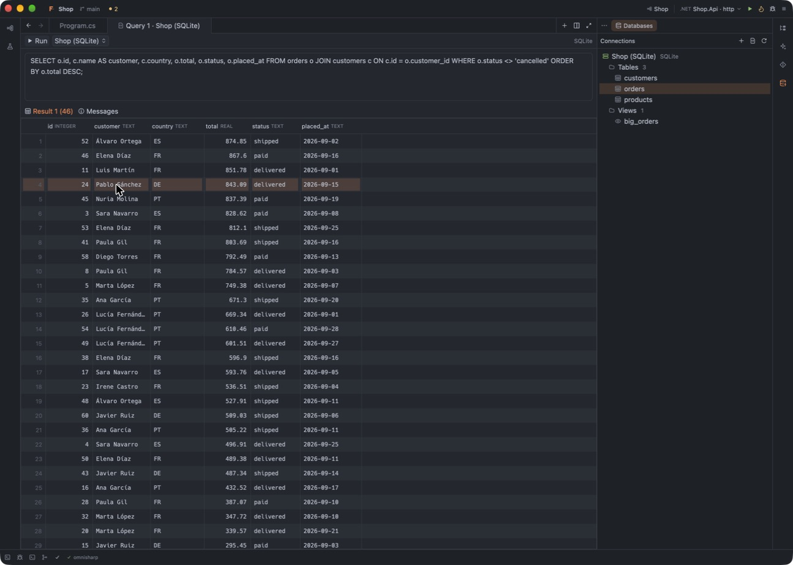

# Forge Guide

Forge is the opinionated IDE for real-world .NET, Go, Rust and JavaScript development, with agents built in and built on Zed. It is a native, GPU-rendered editor that already knows how to run, test and debug your projects, and how to work on them with an AI agent. This guide covers everything it does.

- [Install and update](#install-and-update)
- [Getting started](#getting-started)
- [Search and replace](#search-and-replace)
- [Panels and layout](#panels-and-layout)
- [Settings](#settings) and [colours and fonts](#colours-and-fonts)
- [Run and debug](#run-and-debug) and the [terminal](#terminal)
- [.NET](#net)
- [Tests](#tests)
- [Agents](#agents)
- [Git and GitHub](#git-and-github)
- [HTTP requests](#http-requests)
- [Database Explorer](#database-explorer)
- [Containers](#containers)
- [Extensions](#extensions)

## Install and update

Forge runs on macOS 13 or later (Apple silicon and Intel) and on Linux (x86_64 and ARM64, with glibc 2.35 or later: Ubuntu 22.04, Debian 12, Fedora 36 and later), under Wayland or X11. To install it, or update it by hand, run this in a terminal:

```bash
curl -fsSL https://raw.githubusercontent.com/fernandoescolar/forge/main/scripts/install.sh | bash
```

It downloads the latest release for your Mac from the [releases page](https://github.com/fernandoescolar/forge/releases), checks its signature, quits Forge if it is running, puts Forge.app in Applications (`~/Applications` if you can't write to Applications) and adds a `forge` command to `~/.local/bin`: `forge .` opens the current folder, `forge file.cs` a file, whether Forge is running or not. `curl … | FORGE_VERSION=0.0.2 bash` installs a given version.

On Windows (preview: x86_64), run this in PowerShell instead:

```powershell
irm https://raw.githubusercontent.com/fernandoescolar/forge/main/scripts/install.ps1 | iex
```

It downloads `Forge-<version>-windows-x86_64.zip`, checks it against the SHA-256 the release lists, unpacks it into `%LOCALAPPDATA%\Programs\Forge`, adds Forge to the Start menu and a `forge` command to your PATH. As on Linux, `forge .` while Forge runs opens the folder in it, and a Forge that is running keeps running until you restart it. Forge keeps its settings in `%LOCALAPPDATA%\Forge`.

On Linux it downloads `Forge-<version>-linux-<arch>.tar.gz`, checks it against the SHA-256 the release lists, unpacks it into `~/.local/opt/forge`, adds Forge to your desktop's applications (with its icon) and adds the `forge` command. A Forge that is running keeps running: restart it to use the new one. `forge .` while Forge runs opens the folder in it rather than starting another Forge. The tarball can also be unpacked anywhere by hand: `forge/bin/forge` runs it.

To install from the zip instead, download `Forge-<version>-<arch>.zip` (`aarch64` for Apple silicon, `x86_64` for Intel), unzip it and move **Forge.app** to Applications. Until Forge is signed with an Apple Developer ID, macOS quarantines what the browser downloads, and a quarantined Forge doesn't start (not even after *Open Anyway* in System Settings › Privacy & Security). Take it out of quarantine once:

```bash
xattr -dr com.apple.quarantine /Applications/Forge.app
```

Release builds keep themselves up to date (on Linux, when installed from the tarball): they look for a new version at startup and every few hours and install it in the background. Then a dialog asks whether to restart now: *Restart Now* asks about unsaved changes, if there are any, and opens the new version with the projects you had open; *Later* keeps working with the current one, and the update applies the next time Forge starts. Forge › *Check for Updates…* looks right away (or asks again about an update that is waiting).

Forge uses the tools you already have, found through your shell's `PATH`:

| For | Forge uses |
| --- | --- |
| .NET | the .NET SDK (`dotnet`); `dotnet-ef` for migrations, which Forge offers to install |
| Rust, Go | `cargo`, `go`, and the language servers Zed installs |
| JavaScript and TypeScript | Node.js, and your package manager (npm, pnpm, Yarn or Bun) |
| Python | `python3`, or the project's `.venv`; pytest for tests |
| Agents | the agent's own command, as listed in `agents.json` (Claude Code's runs with `npx`) |
| GitHub | the [`gh`](https://cli.github.com) command, signed in with `gh auth login` |

## Getting started

- **Open a folder:** File › Open (⌘O) asks for a folder (or files) and opens it in a new window; the window you asked from closes if it had nothing open. You can also drop a folder on the Dock icon, or run `forge <path>` in a terminal. File › *Open Recent…* (⌥⌘O) picks one of your recent projects. File › *New Window* opens an empty window on the welcome page, with the docks laid out like the window you were in.
- **Coming back:** when you quit (or close the last window), Forge remembers its windows: their projects, tabs and docks. The next start reopens them as they were, also when you start it with a folder (`forge <path>`), which then opens in its own window or brings forward the one that already shows it. A window you close while others stay open is forgotten.
- **Find anything:** ⌘P opens files, ⌘⇧P runs any command, ⌘F finds in the open file and ⌘⇧F searches the project (see [Search and replace](#search-and-replace)).
- **Run and debug:** pick what to run in the title bar, then Run or Debug (see [Run and debug](#run-and-debug)).
- **Get around:** the status bar shows errors and warnings, what the language servers and agents are doing, the debug session, merge conflicts and your branch's pull request; each one opens what it is about.

## Search and replace

- **In the open file:** ⌘F (Edit › Find) opens the find bar above the editor, with the selection or the word under the cursor as the query. Matches highlight as you type; Enter and ⇧Enter (or ⌘G and ⇧⌘G) go to the next and previous one, ⌥Enter selects them all, and Escape closes the bar. ⌥⌘L limits the search to the selection.
- **In the whole project:** ⌘⇧F (Edit › Find in Project) opens a search tab. Type the query and press Enter: the results show as excerpts of every file that matches, which you can edit in place. ⌘⇧F again goes back to the query; Escape moves between the query and the results. ⌘⇧J shows the *include* and *exclude* filters (paths or globs such as `src/**/*.cs`, separated by commas); the button next to them also searches files your `.gitignore` leaves out.
- **Options:** the buttons at the end of the query, or ⌥⌘C *match case*, ⌥⌘W *whole word* and ⌥⌘X *regular expression*. With a regular expression, the replacement can use the groups it captured (`$1`).
- **Replace:** ⇧⌘H (or Edit › Find and Replace) adds the replacement field. Enter replaces the current match and moves to the next; ⌘Enter replaces them all, in the file or across the project.
- **Up and Down** in the query go through your earlier searches.

## Panels and layout

Panels sit on the left, right and bottom of the window. Click a panel's button to show it, and click it again to hide it.

- **Move a panel:** drag its button, or the ⋯ grip in its header, to another side. You can also right-click the button and pick *Dock Left / Right / Bottom*.
- **Show panels together:** drop a panel's button on another's (or right-click › *Show with …*) and the dock shows both, one above the other (side by side in the bottom dock). Clicking either button shows the group; drag the divider between them to resize (double-click it to share evenly again); *Show Alone* separates them.
- **Find a panel:** View › Panels lists every panel, Forge's and the extensions', by name.
- **Hide panels you don't use:** right-click a button › *Hide from the Sidebar*, or use View › *Show or Hide Panels…* to pick them from a list. For example, hide the Solution Explorer when you work with Go. Pick a panel again to bring it back.
- **Extension panels** live in *slots*. Drag a tab onto another slot to group them, within its slot to reorder, or to a window edge to give it a slot of its own.

Forge remembers the layout: where each panel is, which ones are hidden and open, and their sizes for each project.



## Settings

**Forge › Settings…** (⌘,) opens the Settings tab: every setting, in sections (Appearance, Editor, Workspace, Files, Languages, Terminal, Git, Debugging, Agents, .NET, and one per extension that has settings), with a search box. Changes save as you make them; a dot marks what differs from the default, and the arrow next to it resets it. Lists and maps open the file at the right place.

The settings are stored in files in `~/Library/Application Support/Forge/config` (on Linux, `~/.local/share/forge/config`), and you can also edit them there:

| File | What it holds |
| --- | --- |
| `settings.json` | Your settings, on top of Forge's defaults (*Open Default Settings* lists them all) |
| `keymap.json` | Your key bindings (*Open Default Key Bindings* lists the defaults) |
| `palettes/*.json` | Colour palettes, one theme each |
| `agents.json` | The agents threads can talk to, and MCP servers |
| `dotnet.json` | Solution Explorer and NuGet options |
| `extensions.json` | Extension settings |
| `AGENTS.md` | Your instructions for agents, in every project (see [Agents](#agents)) |

Forge applies a file as soon as you save it. Settings for a single project go in `.forge/settings.json` inside the project, and its tasks and debug scenarios go in `.forge/tasks.json` and `.forge/debug.json`. Forge also reads `.vscode/tasks.json` and `.vscode/launch.json`. The project's `.forge/` folder also holds its instructions for agents (`AGENTS.md`), its customized file templates (`templates/`) and the worktrees of threads that work in one (`worktrees/`, which git ignores).

## Colours and fonts

Every file in `config/palettes/` becomes a theme. Forge ships **Forge Dark** and **Forge Light** (the defaults, which follow the system appearance) and **Dracula**. A palette names about 30 colours:

```jsonc
{
  "name": "Dracula",
  "ui":      { "window": "#21222c", "editor": "#282a36", "accent": "#bd93f9", … },
  "syntax":  { "keyword": "#ff79c6", "string": "#f1fa8c", "type": { "color": "#8be9fd", "font_style": "italic" }, … },
  "terminal":{ "red": "#ff5555", … },
  "overrides": { "editor.wrap_guide": "#ffffff10" }
}
```

When you save a palette, its theme reloads. Syntax scopes inherit from their prefix, so `"string"` also colours `string.special` unless you set that one too. To make your own palette, copy a file, change its `"name"` and select it in `settings.json`:

```jsonc
{
  "theme": "My Palette",
  "buffer_font_family": "Hack Nerd Font Mono",
  "buffer_font_size": 14
}
```

## Run and debug

Pick what to run in the title bar (.NET apps and tests, Rust, Go, `package.json` scripts and Python programs), then Run or Debug. Scripts run with the package manager the project uses (its `packageManager` field or lockfile: npm, pnpm, Yarn or Bun). Python programs are the top-level files of a project with an `if __name__ == "__main__":` block, packages with a `__main__.py`, and Django's `manage.py runserver`; they run with the project's `.venv` (or `venv`) when it has one. A .NET app with several launch profiles in `Properties/launchSettings.json` gets a target per profile; Run and Debug both apply its environment variables, URLs and arguments; the flame button runs a .NET app with hot reload (see [.NET](#net)). The last test result stays next to it.

File-based .NET apps (a single `.cs` that opens with `#:` directives, run with `dotnet run --file`) are targets too, with a target per profile of their `app.run.json`, and debug like any other app. **Aspire** app hosts, a project or a single-file `apphost.cs` with `#:sdk Aspire.AppHost.Sdk`, come first in the list. Forge also finds them in the `.aspire` folder and wherever the Aspire CLI is set up to look (`appHost.path` in `aspire.config.json`, or `appHostPath` in `.aspire/settings.json`), and takes a single-file app host's profiles from `aspire.config.json` when it has no `apphost.run.json`. While one runs, the title bar shows a button that opens its dashboard already signed in (also Run › Open Aspire Dashboard). Debug runs the app host in a terminal and each of its .NET projects (and file-based apps) under the debugger, as Aspire asks for them: breakpoints work in every service, their output still reaches the dashboard, and Stop ends the app host and all of them. Containers and other resources run as usual.

Debugging uses each language's debugger: CodeLLDB for Rust, Delve for Go, debugpy for Python, the JavaScript debugger for Node, and netcoredbg for .NET. Set breakpoints in the gutter; the debugger opens in its panel when a session starts. Projects can add their own tasks and debug scenarios in `.forge/tasks.json` and `.forge/debug.json`.



## Terminal

Terminal › *New Terminal* opens a terminal in the bottom dock, in the project's folder and with your shell. Each terminal is a tab, and you can split the panel to see two side by side. ⌃↩ (or Terminal › *Ask the Agent About the Output*) sends the selection, or the last lines, to an agent (see [Agents](#agents)).



## .NET

The **Solution Explorer** shows `.sln`/`.slnx` solutions as Visual Studio does: solution folders, projects, dependencies and nested files. Creating, renaming, moving, copying and deleting files keeps the project files up to date. Build, test, run, watch, pack and publish from the context menu. Apps with launch profiles (`Properties/launchSettings.json`) get a run target per profile in the title bar.

**Hot reload.** With a .NET app selected in the title bar, the flame button runs it with `dotnet watch`: code changes apply to the running app as you save, and it restarts when a change can't be applied. Stop ends it.

**User secrets and Entity Framework.** A project's context menu has *Manage User Secrets*, which opens its `secrets.json` (and sets up user secrets the first time). Projects that use Entity Framework Core also have *Add Migration…*, *Update Database*, *Remove Last Migration* and *List Migrations*. They run `dotnet ef` in a terminal, with the app that references the project as the startup project, and offer to install `dotnet-ef` when it is missing.

**Fix all occurrences.** On a C# warning or suggestion that has a fix, the code actions menu (⌘↩ or ⌘.) also offers *Fix all … in this file*, *in the project* and *in the solution*, as Visual Studio does (for example *Fix all “Unnecessary using directive” (CS8019) in the project App*). OmniSharp computes the fix; the files it changes open in a tab to review before you save them, and ⌘Z undoes them.

**Global usings.** On the `using` lines at the top of a C# file, ⌘↩ offers *Move usings to GlobalUsings.cs*: they become `global using` directives in that file at the root of the project (created when it doesn't exist; ones it already has aren't repeated), and leave the file. *…in every file of* the project does it for all of its files at once, as does *Move Usings to GlobalUsings.cs* in a C# project's context menu in the Solution Explorer. The changed files open in a tab to review before you save them. Usings inside a namespace, after a file-scoped `namespace` or behind `#if` stay, since moving them would change what they mean. The file is `globalUsingsFile` in the .NET settings (`dotnet.json`), relative to the project's folder: `_Imports.cs`, `Properties/Usings.cs`…

The **NuGet** tab browses, installs, updates and consolidates packages, including with central package management. In project files, package names complete as you type, and outdated versions are marked; ⌘↩ (or ⌘.) updates one.



## Tests

The **Tests** panel (View › Panels › Tests, or Run › *Run All Tests*) finds the tests in the workspace from their source: .NET test projects, Go modules (`func TestXxx(t *testing.T)`), Cargo packages (`#[test]`, `#[tokio::test]`…, unit and `tests/` targets) packages that use Jest or Vitest (`describe` / `it` / `test` in `*.test.*` and `*.spec.*` files) and Python projects (`test*` functions and methods of `Test*` or `unittest.TestCase` classes in `test_*.py` and `*_test.py` files; parametrized cases show under their test). Run everything, a project, a class, package, module or file, or a single test; failed tests can run again on their own. The bug button next to each one runs it in the debugger instead, stopping at breakpoints (.NET, Go, Rust, Python, Jest and Vitest). Results show in the tree and next to each test in the editor's gutter; a failure shows its message with links to the lines it mentions, and *Fix with agent* sends it to an agent. Tests run with each project's tool (`dotnet test`, `go test`, `cargo test`, `npx jest` / `npx vitest`, `python -m pytest` with the project's virtual environment) and your shell's environment.



## Agents

Agents work in **threads**. A thread is one conversation with an agent that speaks the [Agent Client Protocol](https://agentclientprotocol.com), such as Claude Code, Codex, Gemini or GitHub Copilot. You list agents in `agents.json`. There are three ways to start one:

- **The thread tab** (⌘⇧A, or the spark in the title bar; ⌘⌥N starts a new one). The conversation fills the editor area. You see your messages, the agent's answers, its tool calls with their terminals, plans and permission requests. Under the input are the session's settings (mode, model and others the agent offers) and its usage. **Changes** lists every file the agent modified, with lines added and removed. Click a file, or *Review*, to see the changes as a diff in a tab, then keep or undo each file or all of them.
- **In the code** (⌃↩ in any file). A question card opens right below the selection. It keeps the latest answer, the changes to review and a reply box.
- **Fix with agent**, from an error's popover, Agents › Fix the Problem at the Cursor, or a failed test. Merge conflicts and pull request reviews go to agents too (see [Git and GitHub](#git-and-github)).



**Reading a thread.** Each turn starts with your message, set apart so it is easy to find when you scroll back, followed by the agent's part: a header with how long it worked (or a timer while it works), its answer, its thoughts folded to their first line, and one compact list of what it did. Reads, searches and finished commands take one line each; click one to see its output or diff. Running commands, failures and anything waiting for you stay open. When a turn changed files, a summary closes it: each file with its added and removed lines and its diff unfolding in place; *Review* opens them in the review tab beside the thread (Keep / Undo on each change), *Undo turn* puts every file of the turn back as it was before it, and the undo button on a file does it for that file alone (if a later turn changed the same files, Forge asks first). Undone files stay listed, struck through. While the agent works, a bar above the input says what it is doing now and for how long, in the warning colour when it waits for you, with *Stop* next to it.

While the agent works, the thread **follows it**: the file it reads or writes opens next to the conversation, and while it runs a command, that command's terminal. If an agent isn't signed in, a sign-in card appears and the login runs in a terminal inside Forge. Permission requests can be answered once, always for that tool, or by the mode you choose for the session. By default (Settings › Agents › *Let the agent decide*), agents that have an auto mode, such as Claude Code and Codex, use it: they run what they judge safe without asking, as in their own apps, and only ask about the rest. Agents read your unsaved edits, and their writes go through the editor. Paths outside the project are refused.

**Reviewing changes.** Wherever a file the agent changed is open, the editor shows what changed since before the agent, with **Keep** and **Undo** on each change (⌘⌥Y / ⌘⌥Z at the cursor). Kept changes become part of the file; undone ones go back as they were and the file is saved. **Checkpoints:** each message you send is one. *Restore checkpoint* on a message puts every file the agent wrote after it back as it was. The pencil on a message puts it back in the input to edit and send again.

**Checking the changes.** After a turn in which the agent changed files, the thread lists their errors and warnings once the language servers have caught up, says whether they are new, and opens each one at its line. *Ask the agent to fix them* sends them back (queued if the agent is working). Turn it off with `verify_changes` in Settings › Agents.

**The composer.** Type `@` to mention files, folders and symbols (`@src/app.rs:42`), or `@problems` (the project's errors and warnings), `@diff` (your uncommitted changes) and `@terminal` (the latest terminal output). A leading `/` lists the agent's commands. Paste an image, or drop images and files from Finder, to attach them. While the agent works, Enter queues your message: it goes when the turn ends, or right away with *Send now*. The active file and selection are attached unless you leave them out.

**The Threads panel** lists the open threads and where each stands, and under *Earlier* the project's saved conversations. Hover a row to close a thread (it stays under Earlier) or delete it for good; saved conversations can be deleted the same way.

**Around the IDE.** Git › *Write Commit Message with the Agent* (or alt-tab in the commit box) fills the Git panel's commit box with a message for the staged changes, in the style of your recent commits. In a terminal, ⌃↩ (or Terminal › *Ask the Agent About the Output*) sends the selection, or the last lines, to the agent to explain and fix. When two threads change the same file, both say so.

**Anywhere in Forge.** The status bar shows what the threads are doing (waiting for you, working, files to review) and jumps to them. When a thread finishes or needs you while Forge is in the background, you get a notification.

**Commits and pushes the agent proposes.** Agents don't commit or push behind your back. Forge gives them tools to propose a commit or a push (agents that take HTTP MCP servers, such as Claude Code), and asks them to use them. The proposal shows up in the thread as a card with the message and the files. *Commit* commits exactly those files. *Edit in Git panel* stages them and puts the message in the Git panel, where you change it and commit as usual. *Decline* says no. The agent waits for your answer and hears the result: the new commit's SHA and message, or that you declined. Forge never answers a `git commit` or `git push` command for you, whatever the permission mode (except *Super user*). When an agent asks to run `git commit`, the request also offers *Commit from Forge instead*, which turns it into the same card.

A proposed push shows the branch, where it goes and the commits it takes. It goes to the branch's upstream, or creates the branch on `origin` and makes it the upstream; it is never forced. *Push* pushes it the way the Git panel does, and asks for credentials if they are needed. *Decline* says no. A `git push` the agent asks to run offers *Push from Forge instead*.

**Forge's tools for agents.** Besides committing and pushing, agents that take HTTP MCP servers (Claude Code among them) get tools that act through Forge, so you see what they do. Forge asks them to prefer these tools to doing the same in a shell:
- *Run tests* runs tests in the Tests panel: all of them, those of a file or folder, or those whose name matches. Results show in the gutter, and the agent gets each failure with its place and message.
- *Errors and warnings* reads the language servers' problems, your unsaved edits included, instead of building the project.
- *Go to definition* and *Find references* ask the language server. *Rename a symbol* uses its rename, like the editor's. When writes are reviewed, the rename shows as a card with the places and files it touches, and waits for *Rename* or *Decline*. The renamed files join the thread's changes.
- *Run the app* starts a run target as the title bar's Run does, in a terminal you see. The agent reads its output and can stop it.
- *Code actions* lists the language server's quick fixes and refactors on some lines, and *Apply a code action* applies one. *Format a file* uses the project's formatter. Like a rename, these show as a card when writes are reviewed, and their files join the thread's changes. *Type and docs* (hover) and *Find symbols* (workspace symbols) read the language server too.
- *Set a breakpoint* (with an optional condition) and *Start debugging* a run target or tests. The agent waits until the program stops and reads the stack and local variables. Then it can *Continue or step*, *Evaluate an expression* and *Stop debugging*. You follow the session in the Debug panel and the stopped line in the editor.
- *Send an HTTP request* goes through the `.http` support: a request of a `.http` file, or one the agent writes, with your selected environment. The response tab shows it.
- *Ask the user* puts a question in the thread, with options as buttons, a box for another answer, and *Skip*. The agent waits for your answer instead of ending its turn. *Notify the user* shows a notification, for example when a long task finishes.
- *What the user is looking at* tells the agent where you are: the file and line, what you selected, your open files, the problems near your cursor, your terminal's last output and the tests that failed in your last run. So "fix this" or "why does this fail?" need no more explaining.
- *Show a file* opens a file at a line or a range for you. *Show your changes* opens the thread's review of its changes.

These calls appear in the thread with their names ("Run tests", "Find references") and what they were asked.

**Extensions' tools.** Extensions can offer agents tools of their own, through the same `forge` server. The Database Explorer does: agents can list your connections, read their schema, and run SQL on them, without credentials of their own. So does Containers: agents see your containers and read their logs, and start, stop or restart them, or bring a Compose project up. A tool that only reads runs when an agent calls it. Any other, such as running a query, shows in the thread with its arguments, and runs only if you *Allow* it (with *Super user*, it runs without asking). Agents see an extension's tools in threads started after it loads.

**Threads in a worktree.** Agents › *New Thread in Worktree* starts a thread that works in a git worktree of its own (`.forge/worktrees/<name>`, on branch `forge/<name>`, from your last commit): it never touches the files you are editing, nor another thread's. A bar at the top of the thread shows its branch. *Apply to project* copies its changes into your files as uncommitted changes, to review in the Git panel. Your own uncommitted changes stay: each file is merged with yours, and only where you both changed the same lines are there conflict markers, which the merge editor resolves. *Remove…* deletes the worktree, with or without its branch, and ends the thread. Agents › *Worktrees…* applies or removes any of them, also after a restart.

**Your instructions.** Forge sends standing instructions with the first message of every new session: your `AGENTS.md`, for every project, and the project's own, from `.forge/AGENTS.md` and `AGENTS.md` at its root (every one that exists, so agents that don't read `AGENTS.md` themselves get it too). `instructions_files` in `agents.json` changes which project files those are, relative to the project's root. Edit them from Agents › *Edit Project Instructions* (the first of those files that exists) and *Edit Your Instructions*. The thread notes when they were sent.

**What agents learn.** When an agent finds out something every future session should know (how to build or test the project, a convention, a trap), it can propose a note. The note shows in the thread, editable, with *Remember* and *Don't*: kept, it goes under *Notes from agents* in the project's instructions file (the first one that exists, else `.forge/AGENTS.md`), so the next sessions start knowing it.

**Skills and prompts.** Write them once, in Markdown, and every agent gets them, whether it has skills of its own or not:

- A **skill** is a file in the project's `.forge/skills/` (`deploy.md`, or a folder `deploy/` with a `SKILL.md` and whatever files it mentions). Each one is a tool of Forge's `forge` server: agents see its description, and when a task matches they call it and follow the instructions it returns.
- A **prompt** is a file in `.forge/prompts/` (`review.md`). Type `/review` in a thread (it is offered with the agent's own commands) to send it; `$ARGUMENTS` in it becomes what you type after the command (`/review src/parser.rs`), or that text goes after it. The thread shows what you typed and which prompt it sent.

Both may start with front matter, `name:` and `description:` (otherwise the file's name, and the text's first line):

```markdown
---
description: Add a database migration and update the models
---
Create the migration with `make migration NAME=<what it does>`, then …
```

Skills and prompts in Forge's config folder (`skills/` and `prompts/` next to your `AGENTS.md`) are for every project; a project's own replace them by name.

**MCP servers** listed in `agents.json` are passed to every session:

```jsonc
"mcp_servers": [
  { "name": "github", "command": "github-mcp-server", "args": ["stdio"], "env": { "GITHUB_TOKEN": "…" } }
]
```

## Git and GitHub

Git › *Changes* is the Git panel (stage, commit, push), *History* the commit graph.

**Tags.** Git › *Create Tag…* tags the current commit (HEAD); to tag another one, right-click it in the History panel (or in the Git panel's commit list) and choose *Create Tag…*. Give it a name and, optionally, a message, which makes it an annotated tag. Tick *Push it to …* to send it to the branch's remote (`origin` when the branch tracks none) right away; Forge asks for credentials the way it does for a push.

**Merge conflicts.** Each conflict in the editor has *Use ours*, *Use theirs*, *Use both* and *Resolve with Agent*, which asks a thread to settle that conflict. While the project has conflicts, the status bar offers to resolve all of them with the agent (also Git › *Resolve Conflicts with the Agent*). The agent edits the files; you stage and commit.

**The merge editor** (Git › Merge Conflicts › *Open Merge Editor…*, on the active file or a conflicted one you pick) shows a file with conflicts in three panes: yours and theirs on top, each with the conflicts resolved to that side and highlighted, and the result below, which is the file itself. *Accept Yours*, *Accept Theirs* and *Accept Both* resolve the conflict at the cursor; the arrows move between conflicts, and the top panes follow. You can also edit the result by hand. *Mark as Resolved* saves it and, when git has the file as conflicted, stages it.

**Pull requests** come from GitHub through the [`gh`](https://cli.github.com) command, signed in with `gh auth login`. When the branch you have checked out has a pull request, the status bar shows its number and its checks (failing, running or passed), and keeps them current. Its menu opens it on GitHub, shows its review comments, asks an agent to review it, or lists the others. Git › *Pull Requests…* lists the open ones, to check one out, open it, review it with an agent or show its comments. Review comments show under the lines they are about, in every editor of the file, and a list jumps to each.

## HTTP requests

In a `.http` (or `.rest`) file, click the run button next to a request, or put the cursor on it and press ⌘↩ (or Run › HTTP Requests › *Send Request*). The response opens beside it. Variables come from `@name = value` lines, the environment chosen in Terminal › *HTTP Environment…* (from the nearest `http-client.env.json`, plus `http-client.env.json.user`), earlier requests named with `# @name login` (`{{login.response.body.$.token}}`, `{{login.response.headers.Location}}`) and `{{$guid}}`, `{{$timestamp}}`, `{{$datetime iso8601}}`, `{{$randomInt 1 10}}`, `{{$processEnv NAME}}`, `{{$dotenv NAME}}`.

The response tab shows the status, time, size and headers, then the body (formatted when it is JSON). The body shows as it arrives, so slow and streaming responses (server-sent events, long downloads) fill in as they go. A binary body (an image, a PDF, a zip) is saved to a file, and Forge offers to open it. Each `.http` file has one response tab, reused by every request you send from it; sending another request, or Terminal › *Cancel HTTP Request*, stops the one still running. Terminal › *HTTP Request History…* lists the requests you sent lately, from any file, to send one again.

## Database Explorer

The **Databases** panel (View › Panels › Databases; an extension that comes with Forge) browses SQL Server, PostgreSQL, MySQL, MariaDB, SQLite, MongoDB and Redis databases. Click **+** to add a connection: pick the database, then the server, user and password (kept in the macOS keychain if you leave *Save password* on), or the SQLite file. A MongoDB connection can also be a connection string (`mongodb+srv://…`, as Atlas gives it), and a Redis one a URL (`redis://…`, `rediss://…`) or **Sentinel** (the sentinels, the master's name and their password): Forge connects to the master they name, and finds it again after a failover. Connection strings and passwords stay in the keychain. *Test* tries it first.

- **Browse.** Expand a connection to see its databases, schemas, tables and views. Right-click for more: connect and disconnect, refresh, edit, duplicate or delete the connection, copy a name or a `SELECT`.
- **Rows.** Double-click a table or view to open its rows in a tab, a page at a time. Click a column's header to sort by it, type a condition in *WHERE* and press Enter to filter, and move between pages at the bottom.
- **Edit.** In a table with a primary key, double-click a cell to change it (Enter keeps it, Esc cancels), **+** adds a row and **−** (or Delete) deletes the selected ones. Changes are coloured until you *Save*, which applies them all in one transaction, or *Discard*. Right-click a cell to set it to NULL or copy values. Tables without a primary key are read-only.
- **MongoDB.** Expand a connection to see its databases and their collections; double-click one to open its documents: the first page shows right away, and the menu next to the arrows sets how many per page (10 to 1000; it starts at the *Page size* setting). *Find* takes a filter, a sort and the fields to show, as JSON (`{ "status": "active" }`, `{ "createdAt": -1 }`), and goes a page at a time; *Aggregate* runs a pipeline (`[{ "$match": … }, { "$group": … }]`, ⌘Enter). Besides JSON you can write `ObjectId("…")`, `ISODate("2024-05-31")`, `NumberLong("…")`, `NumberInt(…)`, `NumberDecimal("…")` and `UUID("…")`. Filters, pipelines and documents are highlighted as JSON. The table shows each document's top-level fields; select one to see it whole, as text in that same form, edit it and *Save* (it replaces the document; its `_id` can't change). *Insert Document* adds one; the trash button deletes the selected one.
- **Redis.** Expand a connection to see its databases (`db0`…, those with keys) and, in each, its keys as a tree split at `:` (`user:1:profile` under *user* › *1*), found with `SCAN` a batch at a time (*Load more keys…*), never `KEYS`. With a database (or anything in it) selected, the filter box at the top shows only the keys matching a pattern (`user:*`, `*:session`). Double-click a key to open it: a string as text (highlighted when it is JSON); a hash, list, set, sorted set or stream as a table, a page at a time, where you edit cells, mark rows to delete and *Save* them all, and add entries below. The key's tab also sets or removes its TTL, renames it and deletes it. Right-click a database for *New Key…* and the *Console*, which runs commands as `redis-cli` does (`HGETALL user:1`, `INFO memory`) on the database you pick; right-click a namespace to delete every key under it. Values that aren't text show their bytes as `\xNN`, and are saved from that form.
- **Queries.** *New Query* (the file icon, or right-click › New Query) opens a query tab on the selected connection and database. Write SQL and press ⌘Enter or *Run*: each result appears in its own tab, with what the other statements did under *Messages*. *Cancel* stops a long query. *Database Explorer: Open the Active File (or Selection) in a Query* in the command palette starts one from a `.sql` file.



Its settings (page size, query row limit, whether to confirm before saving) are in Forge › Settings › Database Explorer.

## Containers

The **Containers** panel (View › Panels › Containers; an extension that comes with Forge) shows your Docker containers, grouped by Compose project, and your images. It uses the `docker` command, so it works with whatever runs the engine: Docker Desktop, OrbStack, Colima, or Podman (set *Docker command* to `podman`). It follows Docker's events, so containers you start or stop anywhere else show up at once.

- **Containers.** Each Compose project shows how many of its containers are running; under it, its services with their status (and health) and published ports (`8080→80`). Containers that Compose didn't start are under *Other containers*. Select one for the buttons at the top: start or stop, restart, follow its logs, open a shell.
- **Logs and shells** open in Forge terminals: double-click a container (or *Follow Logs*) for its last lines and then the new ones as they come, and *Open Shell* runs a shell inside it (`sh`, or the *Shell* setting).
- **More.** Right-click a container to pause or resume it, inspect it (its `docker inspect`, in a tab), copy its id or remove it. Right-click a project for *Up*, *Start*, *Stop*, *Restart*, *Open Compose File* and *Down* (which removes its containers and networks, not its volumes).
- **Images.** The *Images* view lists them with their size and age, the ones in use highlighted; right-click to inspect or remove one.
- **Compose Up.** *Containers: Compose Up* in the command palette runs `docker compose up -d` for the active compose file, or for the project's.

Agents get four tools: `containers` and `logs` (with a `grep`) read at once; `control` (start, stop or restart a container or a project) and `compose_up` ask you first. Its settings (the Docker command, the shell, how many log lines to show, whether to confirm before removing) are in Forge › Settings › Containers.

## Extensions

Extensions add panels, tabs and commands, and can work with the editor, run programs and keep their own data. They are written in TypeScript with React, and Forge renders them natively. Open the **Extensions** panel to see the installed ones.

Extensions are shared as packages: a `.forgeext` file holds an extension with the programs it needs. To install one, use **Extensions › Install from Package…** (or *Install* in the Extensions panel) and pick the file; Forge checks it, unpacks it into `~/Library/Application Support/Forge/extensions` and starts it, replacing an older copy. *Install from Folder…* does the same with an extension's folder.

The **Extensions** panel (Extensions › Extensions Panel) shows a card for each extension: its version and description, where it comes from (*Included with Forge*, *Installed* or *Development*), whether it is running or failed (with the error), the panels it adds (click one to show it) and its commands. The ⋯ button has *Reload*, *Settings* (when it has some), *Export as Package…* (a `.forgeext` file to give to someone else), *Reveal in Finder* and, for ones you installed, *Uninstall…*; none needs a restart. The search box filters the list.

What extensions add is also in the menus: their panels under View › Panels, their commands under Extensions › *the extension's name* (and in the command palette). Extensions run with your rights (they can read files and run programs), so install only ones you trust. [EXTENSIONS.md](EXTENSIONS.md) explains how to write one.

## About Forge

Forge is free software under the GPL-3.0-or-later. It is built with open-source libraries from the [Zed](https://zed.dev) editor: GPUI and the editor, terminal and language components.

